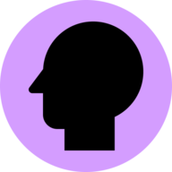

# Neurodiversity

Neurodiveristy Wiki is a crowd-sourced [website](https://neurodiversity.wiki) that aims to spread awareness about neurological conditions. We define neurodiversity as all the ways that our brains work differently from each other. There are millions of people around the world living with the conditions such as ADHD, Autism, Bipolar and OCD. Still, the knowledge level about this is often almost zero. This is understandable as talking about mental health is stigmatized.

The effect of this lack of knowledge can be devastating. Without knowledge, misconceptions and insensitive jokes tend to be common. These make it harder for people to tell others about their conditions. They fear how they'll be perceived or treated.

As the knowledge level of the general population increases, so does compassion and understanding. More people would feel comfortable telling others who they are and how others can help them.

This website tackles the information problem by providing short and
easy-to-read information. We believe that this content should not be
buried in articles on a blog, or written in complex medical language. Nor
should it be local to one country, or on a website with too much focus on
marketing its achievements. It's also common to only focus on one
conditon, even though knowledge about even though knowledge about most of them is lacking. All these things would work against our goal of educating as many people as possible. We couldn't find a website that
fulfilled all of these things, so we made one.

## Want to join us?

We're everything from developers, parents, designers to journalists. To cover as many conditions as possible in a representative way, we need the perspective of many. Together, we can make a wiki that explains these conditions in a simple way for the general public.

So with that said, any help is appreciated. While people who can write, code, design and organize are in need, that is not a requirement. Feedback and personal perspective is also very appreciated! If this is something that interests you, consider joining us.

Reach out on [Twitter DMs](https://twitter.com/neurodiversityw) or [join the Discord server](https://discord.gg/48kqk6KcZ8).

## Contributing

See [CONTRIBUTING.md](/CONTRIBUTING.md) for ways to get started.

## License

[MIT](/LICENSE)
